# Polyglot Codebase Knowledge Graph

> Generated offline by **readmenator**. Supports C, C++, Python, Go, Rust, JS/TS, Java, C#, Shell, PHP, Dart, GDScript, Nim, ASM, Ruby, Swift, Kotlin, Scala, Lua, Elixir.
> No LLMs. No tokens. Pure static analysis. See more [here](https://github.com/grisuno/ReadMenator)

**Total Files Parsed:** 3 | **Total Symbols Extracted:** 2 | **Total Imports:** 3

<!-- ranking_model: v1.0 | weights: {ppr:0.45,auth:0.2,test:0.15,doc:0.1,fresh:0.1} | alpha:0.85 | commit:e63a2e6 | date:2026-07-18 -->


## Table of Contents

1. [Statistics Dashboard](#statistics-dashboard)
2. [Architectural Layers](#architectural-layers)
3. [Ranked Context](#ranked-context)
4. [God Nodes](#god-nodes)
5. [Suggested Questions](#suggested-questions)
6. [Hotspot Analysis](#hotspot-analysis)
7. [Change Impact Analysis](#change-impact-analysis)
8. [Orphans](#orphans)
9. [Query Recipes](#query-recipes)
10. [Structural Knowledge Map](#structural-knowledge-map)
11. [Code Property Graph](#code-property-graph)
12. [Architecture Reference](#architecture-reference)
    - [JS (2 files)](#js-2-files)
    - [PY (1 files)](#py-1-files)

---

## Statistics Dashboard

| Metric | Value |
|--------|-------|
| Total Files | 3 |
| Total Symbols | 2 |
| Total Imports | 3 |
| Call Edges | 82 |
| Inheritance Edges | 0 |
| Languages | 2 |
| Avg Symbols/File | 0.7 |
| Avg Imports/File | 1.0 |

### Top Files by Import Count (Fan-Out)

| File | Imports | Symbols | Language |
|------|---------|---------|----------|
| `crud_generator.py` | 2 | 1 | py |
| `models.js` | 1 | 0 | js |

---

## Architectural Layers

Auto-detected from path patterns, naming conventions, and imported frameworks.

| Layer | Files |
|-------|-------|
| utility | 2 |
| business_logic | 1 |

### utility

- `app.js` (js, 1 symbols)
- `crud_generator.py` (py, 1 symbols)

### business_logic

- `models.js` (js, 0 symbols)

---

## Ranked Context

Files ranked by composite score for the current query context. The ranking combines Personalized PageRank (query relevance), global authority, test coverage, documentation coverage, and code freshness. Model: v1.0.

| Rank | File | Composite | PPR | Authority | Test | Doc |
|------|------|-----------|-----|-----------|------|-----|
| 1 | `app.js` | 0.1000 | 0.0000 | 0.0000 | 0.00 | 1.00 |
| 2 | `crud_generator.py` | 0.0000 | 0.0000 | 0.0000 | 0.00 | 0.00 |
| 3 | `models.js` | 0.0000 | 0.0000 | 0.0000 | 0.00 | 0.00 |

---

## God Nodes

Most architecturally central files ranked by combined import/export degree and symbol richness.

| File | Score | Connections | PageRank |
|------|-------|-------------|----------|
| `app.js` | 0.1 | | 0.0000 |
| `crud_generator.py` | 0.1 | | 0.0000 |
| `models.js` | 0.0 | | 0.0000 |

---

## Suggested Questions

Auto-generated exploration prompts based on graph structure:

- What does app.js depend on, and what depends on it? (0 connections)
- What does crud_generator.py depend on, and what depends on it? (0 connections)
- What does models.js depend on, and what depends on it? (0 connections)
- What is the overall architecture of this codebase?

---

## Hotspot Analysis

Files ranked by combined complexity (symbol count) and centrality (connection count). High-scoring files are architecturally critical and may need refactoring attention.

| File | Complexity | Centrality | Combined | Symbols | Connections |
|------|-----------|------------|----------|---------|-------------|
| `app.js` | 1.000 | 1.000 | 1.000 | 1 | 59 |
| `crud_generator.py` | 1.000 | 0.034 | 0.420 | 1 | 2 |
| `models.js` | 0.000 | 0.051 | 0.030 | 0 | 3 |

---

## Change Impact Analysis

Files sorted by how many other files would be affected if they changed. High-impact files should be changed with caution.

| File | Direct Dependents | Transitive Dependents | Total Impact |
|------|------------------|----------------------|--------------|
| `app.js` | 0 | 0 | 0 |
| `crud_generator.py` | 0 | 0 | 0 |
| `models.js` | 0 | 0 | 0 |

---

## Orphans

Files with no documentation or low connectivity. These are candidates for documentation investment or cleanup.

- `crud_generator.py` (1 symbols, no doc)
- `models.js` (0 symbols, no doc)

---

## Query Recipes

Example queries you can run against this knowledge base using the ranking engine:

```
# Find files most relevant to a concept
readmenator query "Where is the import resolver implemented?"

# Rank files by relevance to a topic
readmenator query "How does documentation generation work?"

# Explain why a file ranks highly
readmenator query "explain readmenator/_documentation.py"

# Trace dependency paths with ranked context
readmenator query "path from CLI to exporter"
```

The ranking model uses the following signals:

- **Personalized PageRank** (45% weight): query-specific relevance via seed propagation
- **Global Authority** (20% weight): structural importance via standard PageRank
- **Test Coverage** (15% weight): fraction of symbols referenced in test files
- **Doc Coverage** (10% weight): presence of docstrings and file-level docs
- **Freshness** (10% weight): recent modification activity

Results include score decomposition and justification paths for each ranked item.

---

## Structural Knowledge Map

```mermaid
graph TD
    classDef mod fill:#1e1e1e,stroke:#ff6666,stroke-width:2px,color:#fff;
    classDef cls fill:#2d2d2d,stroke:#4ec9b0,stroke-width:2px,color:#fff;
    classDef fn fill:#333,stroke:#dcdcaa,stroke-width:1px,color:#dcdcaa;
    classDef ext fill:#111,stroke:#666,stroke-dasharray:5 5,color:#aaa;
    app_js["app.js (js)"]
    class app_js mod;
    app_js_addField["addField"]
    class app_js_addField fn;
    app_js --> app_js_addField
    models_js["models.js (js)"]
    class models_js mod;
    crud_generator_py["crud_generator.py (py)"]
    class crud_generator_py mod;
    crud_generator_py_create_crud["create_crud"]
    class crud_generator_py_create_crud fn;
    crud_generator_py --> crud_generator_py_create_crud
    ext_getElementById["getElementById"]
    class ext_getElementById ext;
    app_js -.->|imports| ext_getElementById
    ext_querySelector["querySelector"]
    class ext_querySelector ext;
    app_js -.->|imports| ext_querySelector
    app_js -.->|imports| ext_getElementById
    app_js -.->|imports| ext_querySelector
    ext_addField["addField"]
    class ext_addField ext;
    app_js -.->|imports| ext_addField
    ext_createElement["createElement"]
    class ext_createElement ext;
    app_js -.->|imports| ext_createElement
    ext_add["add"]
    class ext_add ext;
    app_js -.->|imports| ext_add
    ext_campo["campo"]
    class ext_campo ext;
    app_js -.->|imports| ext_campo
    app_js -.->|imports| ext_createElement
    app_js -.->|imports| ext_createElement
    app_js -.->|imports| ext_createElement
    app_js -.->|imports| ext_createElement
    app_js -.->|imports| ext_createElement
    ext_appendChild["appendChild"]
    class ext_appendChild ext;
    app_js -.->|imports| ext_appendChild
    app_js -.->|imports| ext_createElement
    app_js -.->|imports| ext_appendChild
    app_js -.->|imports| ext_createElement
    app_js -.->|imports| ext_appendChild
    app_js -.->|imports| ext_createElement
    app_js -.->|imports| ext_appendChild
    app_js -.->|imports| ext_createElement
    app_js -.->|imports| ext_createElement
    app_js -.->|imports| ext_createElement
    app_js -.->|imports| ext_createElement
    app_js -.->|imports| ext_appendChild
    app_js -.->|imports| ext_appendChild
    app_js -.->|imports| ext_appendChild
    app_js -.->|imports| ext_appendChild
    app_js -.->|imports| ext_appendChild
    app_js -.->|imports| ext_appendChild
    app_js -.->|imports| ext_appendChild
    app_js -.->|imports| ext_appendChild
    app_js -.->|imports| ext_appendChild
    app_js -.->|imports| ext_appendChild
    app_js -.->|imports| ext_appendChild
    app_js -.->|imports| ext_appendChild
    app_js -.->|imports| ext_querySelector
    ext_remove["remove"]
    class ext_remove ext;
    app_js -.->|imports| ext_remove
    app_js -.->|imports| ext_add
    ext_scrollIntoView["scrollIntoView"]
    class ext_scrollIntoView ext;
    app_js -.->|imports| ext_scrollIntoView
    ext_removeEventListener["removeEventListener"]
    class ext_removeEventListener ext;
    app_js -.->|imports| ext_removeEventListener
    ext_addEventListener["addEventListener"]
    class ext_addEventListener ext;
    app_js -.->|imports| ext_addEventListener
    app_js -.->|imports| ext_addEventListener
    app_js -.->|imports| ext_addEventListener
    ext_preventDefault["preventDefault"]
    class ext_preventDefault ext;
    app_js -.->|imports| ext_preventDefault
    app_js -.->|imports| ext_getElementById
    ext_querySelectorAll["querySelectorAll"]
    class ext_querySelectorAll ext;
    app_js -.->|imports| ext_querySelectorAll
    ext_forEach["forEach"]
    class ext_forEach ext;
    app_js -.->|imports| ext_forEach
    app_js -.->|imports| ext_querySelector
    app_js -.->|imports| ext_querySelector
    app_js -.->|imports| ext_querySelector
    app_js -.->|imports| ext_querySelector
    ext_push["push"]
    class ext_push ext;
    app_js -.->|imports| ext_push
    ext_stringify["stringify"]
    class ext_stringify ext;
    app_js -.->|imports| ext_stringify
    app_js -.->|imports| ext_createElement
    ext_createObjectURL["createObjectURL"]
    class ext_createObjectURL ext;
    app_js -.->|imports| ext_createObjectURL
    app_js -.->|imports| ext_appendChild
    ext_click["click"]
    class ext_click ext;
    app_js -.->|imports| ext_click
    ext_removeChild["removeChild"]
    class ext_removeChild ext;
    app_js -.->|imports| ext_removeChild
    ext_os["os"]
    class ext_os ext;
    crud_generator_py -.->|imports| ext_os
    ext_json["json"]
    class ext_json ext;
    crud_generator_py -.->|imports| ext_json
    ext_sequelize["sequelize"]
    class ext_sequelize ext;
    models_js -.->|imports| ext_sequelize
    ext_require["require"]
    class ext_require ext;
    models_js -.->|imports| ext_require
    ext_define["define"]
    class ext_define ext;
    models_js -.->|imports| ext_define
```



---

## Code Property Graph

Machine-readable Code Property Graph (CPG) in JSON-LD format. This block allows AI agents to parse the full structural graph without additional file reads. Compatible with GraphRAG pipelines.

```json
{"@context": "https://readmenator.dev/cpg/v1", "analysis": {"communities": [], "god_nodes": [{"node_id": "app.js", "score": 0.1}, {"node_id": "crud_generator.py", "score": 0.1}, {"node_id": "models.js", "score": 0.0}], "surprising_connections": []}, "edges": [{"confidence": "EXTRACTED", "relation": "calls", "source": "app.js", "target": "getElementById"}, {"confidence": "EXTRACTED", "relation": "calls", "source": "app.js", "target": "querySelector"}, {"confidence": "EXTRACTED", "relation": "calls", "source": "app.js", "target": "getElementById"}, {"confidence": "EXTRACTED", "relation": "calls", "source": "app.js", "target": "querySelector"}, {"confidence": "EXTRACTED", "relation": "calls", "source": "app.js", "target": "addField"}, {"confidence": "EXTRACTED", "relation": "calls", "source": "app.js", "target": "createElement"}, {"confidence": "EXTRACTED", "relation": "calls", "source": "app.js", "target": "add"}, {"confidence": "EXTRACTED", "relation": "calls", "source": "app.js", "target": "campo"}, {"confidence": "EXTRACTED", "relation": "calls", "source": "app.js", "target": "createElement"}, {"confidence": "EXTRACTED", "relation": "calls", "source": "app.js", "target": "createElement"}, {"confidence": "EXTRACTED", "relation": "calls", "source": "app.js", "target": "createElement"}, {"confidence": "EXTRACTED", "relation": "calls", "source": "app.js", "target": "createElement"}, {"confidence": "EXTRACTED", "relation": "calls", "source": "app.js", "target": "createElement"}, {"confidence": "EXTRACTED", "relation": "calls", "source": "app.js", "target": "appendChild"}, {"confidence": "EXTRACTED", "relation": "calls", "source": "app.js", "target": "createElement"}, {"confidence": "EXTRACTED", "relation": "calls", "source": "app.js", "target": "appendChild"}, {"confidence": "EXTRACTED", "relation": "calls", "source": "app.js", "target": "createElement"}, {"confidence": "EXTRACTED", "relation": "calls", "source": "app.js", "target": "appendChild"}, {"confidence": "EXTRACTED", "relation": "calls", "source": "app.js", "target": "createElement"}, {"confidence": "EXTRACTED", "relation": "calls", "source": "app.js", "target": "appendChild"}, {"confidence": "EXTRACTED", "relation": "calls", "source": "app.js", "target": "createElement"}, {"confidence": "EXTRACTED", "relation": "calls", "source": "app.js", "target": "createElement"}, {"confidence": "EXTRACTED", "relation": "calls", "source": "app.js", "target": "createElement"}, {"confidence": "EXTRACTED", "relation": "calls", "source": "app.js", "target": "createElement"}, {"confidence": "EXTRACTED", "relation": "calls", "source": "app.js", "target": "appendChild"}, {"confidence": "EXTRACTED", "relation": "calls", "source": "app.js", "target": "appendChild"}, {"confidence": "EXTRACTED", "relation": "calls", "source": "app.js", "target": "appendChild"}, {"confidence": "EXTRACTED", "relation": "calls", "source": "app.js", "target": "appendChild"}, {"confidence": "EXTRACTED", "relation": "calls", "source": "app.js", "target": "appendChild"}, {"confidence": "EXTRACTED", "relation": "calls", "source": "app.js", "target": "appendChild"}, {"confidence": "EXTRACTED", "relation": "calls", "source": "app.js", "target": "appendChild"}, {"confidence": "EXTRACTED", "relation": "calls", "source": "app.js", "target": "appendChild"}, {"confidence": "EXTRACTED", "relation": "calls", "source": "app.js", "target": "appendChild"}, {"confidence": "EXTRACTED", "relation": "calls", "source": "app.js", "target": "appendChild"}, {"confidence": "EXTRACTED", "relation": "calls", "source": "app.js", "target": "appendChild"}, {"confidence": "EXTRACTED", "relation": "calls", "source": "app.js", "target": "appendChild"}, {"confidence": "EXTRACTED", "relation": "calls", "source": "app.js", "target": "querySelector"}, {"confidence": "EXTRACTED", "relation": "calls", "source": "app.js", "target": "remove"}, {"confidence": "EXTRACTED", "relation": "calls", "source": "app.js", "target": "add"}, {"confidence": "EXTRACTED", "relation": "calls", "source": "app.js", "target": "scrollIntoView"}, {"confidence": "EXTRACTED", "relation": "calls", "source": "app.js", "target": "removeEventListener"}, {"confidence": "EXTRACTED", "relation": "calls", "source": "app.js", "target": "addEventListener"}, {"confidence": "EXTRACTED", "relation": "calls", "source": "app.js", "target": "addEventListener"}, {"confidence": "EXTRACTED", "relation": "calls", "source": "app.js", "target": "addEventListener"}, {"confidence": "EXTRACTED", "relation": "calls", "source": "app.js", "target": "preventDefault"}, {"confidence": "EXTRACTED", "relation": "calls", "source": "app.js", "target": "getElementById"}, {"confidence": "EXTRACTED", "relation": "calls", "source": "app.js", "target": "querySelectorAll"}, {"confidence": "EXTRACTED", "relation": "calls", "source": "app.js", "target": "forEach"}, {"confidence": "EXTRACTED", "relation": "calls", "source": "app.js", "target": "querySelector"}, {"confidence": "EXTRACTED", "relation": "calls", "source": "app.js", "target": "querySelector"}, {"confidence": "EXTRACTED", "relation": "calls", "source": "app.js", "target": "querySelector"}, {"confidence": "EXTRACTED", "relation": "calls", "source": "app.js", "target": "querySelector"}, {"confidence": "EXTRACTED", "relation": "calls", "source": "app.js", "target": "push"}, {"confidence": "EXTRACTED", "relation": "calls", "source": "app.js", "target": "stringify"}, {"confidence": "EXTRACTED", "relation": "calls", "source": "app.js", "target": "createElement"}, {"confidence": "EXTRACTED", "relation": "calls", "source": "app.js", "target": "createObjectURL"}, {"confidence": "EXTRACTED", "relation": "calls", "source": "app.js", "target": "appendChild"}, {"confidence": "EXTRACTED", "relation": "calls", "source": "app.js", "target": "click"}, {"confidence": "EXTRACTED", "relation": "calls", "source": "app.js", "target": "removeChild"}, {"confidence": "EXTRACTED", "relation": "imports", "source": "crud_generator.py", "target": "os"}, {"confidence": "EXTRACTED", "relation": "imports", "source": "crud_generator.py", "target": "json"}, {"confidence": "EXTRACTED", "relation": "imports", "source": "models.js", "target": "sequelize"}, {"confidence": "EXTRACTED", "relation": "calls", "source": "models.js", "target": "require"}, {"confidence": "EXTRACTED", "relation": "calls", "source": "models.js", "target": "define"}], "generator": "readmenator", "metadata": {"edge_count": 85, "file_count": 3, "language_count": 2, "symbol_count": 2}, "nodes": [{"doc": "Seleccionamos el contenedor de campos y el botón de \"Agregar Campo\"", "id": "app.js", "kind": "module", "label": "app.js", "language": "js", "sha256": "7a66943111977367", "symbol_count": 1, "symbols": [{"kind": "function", "line": 7, "name": "addField"}]}, {"id": "crud_generator.py", "kind": "module", "label": "crud_generator.py", "language": "py", "sha256": "094baecbc3ca498a", "symbol_count": 1, "symbols": [{"kind": "function", "line": 9, "name": "create_crud", "signature": "def create_crud(entity_name, fields)"}]}, {"id": "models.js", "kind": "module", "label": "models.js", "language": "js", "sha256": "844c39ea1da88240", "symbol_count": 0, "symbols": []}], "type": "CodePropertyGraph", "version": "1.0"}
```

---

## Architecture Reference

### JS (2 files)

#### `app.js`
**Path:** `app.js`
**File Doc:** *Seleccionamos el contenedor de campos y el botón de "Agregar Campo"*

**Functions:**
- `addField` (line 7)

#### `models.js`
**Path:** `models.js`

*No symbols extracted*

### PY (1 files)

#### `crud_generator.py`
**Path:** `crud_generator.py`

**Functions:**
- `create_crud` (line 9) `def create_crud(entity_name, fields)`
