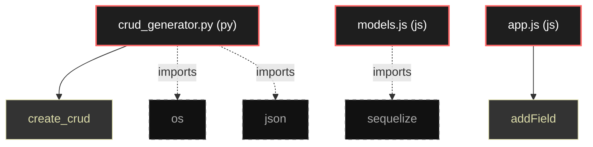

# Polyglot Codebase Knowledge Graph

> Generated offline by **readmenator**. Supports C, C++, Python, Go, Rust, JS/TS, Java, C#, Shell, PHP, Dart, GDScript, Nim, ASM.
> No LLMs. No tokens. Pure static analysis. See more [here](https://github.com/grisuno/ReadMenator)

**Total Files Parsed:** 3 | **Total Symbols Extracted:** 2 | **Total Imports:** 3

## Structural Knowledge Map

---

## Architecture Reference

### JS (2 files)

#### `app.js`
**Path:** `app.js`

**Functions:**
- `addField` (line 7)

#### `models.js`
**Path:** `models.js`

*No symbols extracted*

### PY (1 files)

#### `crud_generator.py`
**Path:** `crud_generator.py`

**Functions:**
- `create_crud` (line 9) `def create_crud(entity_name, fields)`
